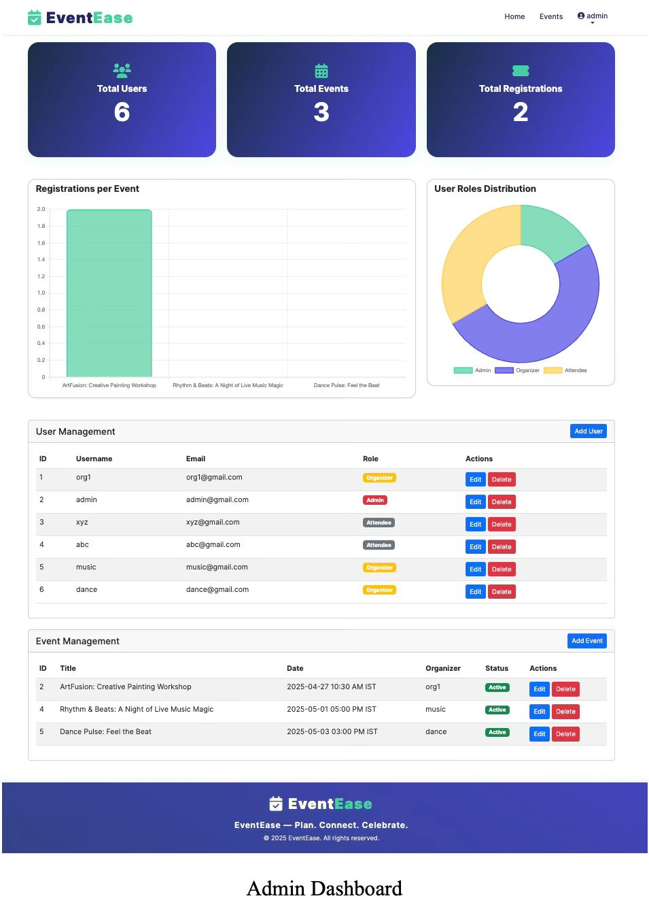

# 🎉 EventEase – Event Management System

**EventEase** is a user-friendly **Event Management System** developed using **Python Flask**, **MySQL**, and **Bootstrap**. The platform allows organizers to create and manage events with images, and attendees to browse and register for them. An admin dashboard is provided for overall platform monitoring and user/event management.

---

## 🔧 Tech Stack

- **Backend**: Python (Flask)
- **Frontend**: HTML, CSS, JavaScript (Bootstrap 5)
- **Database**: MySQL (XAMPP)
- **Tools**: Flask, XAMPP, VS Code

---

## 📌 Key Features

### 👥 User Roles & Authentication
- **Login & Signup** with role-based access
- Three roles:  
  - 🛠️ **Admin**
  - 🎤 **Organiser**
  - 🙋 **Attendee**

### 🏠 Home Page
- Public landing page with event highlights and navigation links

### 🧑‍💼 Admin Dashboard
- View all users and events
- Manage/Remove users and events
- Monitor platform activity

### 📅 Organiser Dashboard
- Create and manage events
- Upload event posters/images
- View registered attendees for their events

### 🙋 Attendee Dashboard
- Browse upcoming events
- Register for selected events
- View list of events they’ve joined

### 🖼️ Event Image Upload
- Organisers can upload images (posters, flyers) while creating events
- Uploaded images are displayed on event listings

---

## ScreenShot





## ⚙️ Setup Instructions


1. **Clone the repository:**
   ```bash
   git clone <repository-url>
   cd Project
   ```

2. **Create and activate a virtual environment:**
   ```bash
   python -m venv venv
   source venv/bin/activate  # On Windows: venv\Scripts\activate
   ```

3. **Install dependencies:**
   ```bash
   pip install -r requirements.txt
   ```

4. **Set up environment variables:**
   Create a `.env` file in the project root with:
   ```
   SECRET_KEY=your-secret-key-here
   ```
   *(Database credentials are set directly in `app.py` by default: user `root`, no password, database `event_management`)*

5. **Create the MySQL database:**
   ```sql
   CREATE DATABASE event_management;
   ```

## Running the Application

1. Ensure your MySQL server is running and the `event_management` database exists.
2. Start the Flask app:
   ```bash
   python app.py
   ```
   The app will run on [http://localhost:5003](http://localhost:5003)

---

## 📝 Future Enhancements

- Admin approval for events  
- Event categories, search & filter  
- Email notifications for registration  
- Organizer profiles & attendee profiles  
- QR code or digital pass for event entry  

---

## 🤝 Contributions

Contributions are welcome!  
Fork the repository, make your changes, and submit a pull request.

---

## 📄 License

This project is licensed under the **MIT License**.

